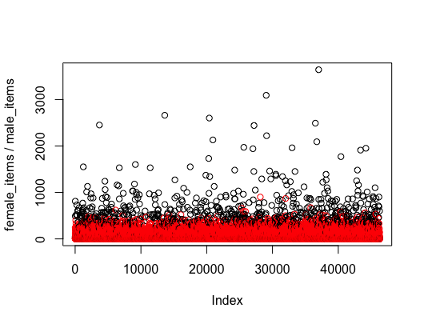

# THE ICONIC customer gender analysis report
#### Olsen.Zheng@outlook.com


## Purpose of the document

Based on the customer behavior data, this document shall be read as an report indicating the analysis process as well as an execution manual of the code appended.

## Analysis structure

The aim of the task is to infer the customers' genders based on the given consuming behavior data, to archieve this, the following analysis steps will be carried out:

* **High level analysis:** Analysis focusing on some overall consumption features whose result can be seen as a rough profile and can give direction or clue to the following modelling and prediction work. This is a **SQL** based analysis upon the give SQLite data file.
* **Data cleaning:** This step is to do a basic data quality check then find the corrent the corrupted data, and furtherly pickup the valuable fields those shall be used the in the following prediction model.
* **Model choose and build:** Chose and build an unsupervised learning model to predict customer gender, model accuracy and performance to be the key point to consider and neccessary optimization will also be taken into account.
* **Conclusion and suggestion:** A conclusion based on the previous analysis result will be given, as well as a suggention of some missing but meaningful features   that may help improve the prediction accuracy.
*  **Summary:** An executive summary including key situation and analysis result will be given for business analysts and decision makers for further analysis and action.

The following parts of this documents will be also unfolded as the above structure.

## High level analysis
The following SQL based analysis are taken out with the results given too.

1. What was the total revenue to the nearest dollar for customers who have paid by credit card?

	*sql code:*
	
	```	
		select sum(a.revenue) from customers a
		where a.cc_payments=1
	```
	
	*result:* 50,372,281.74
	
	In the data dictionary, the four *xx_payments* columns are said to be the Number of times paid by such way, however from the data they are like a boolean flag indicating whether the customer ever used such payment way.
	

2. What percentage of customers who have purchased female items have paid by credit card?


	*sql code:*
	
	```	
		select 
		(
			select count(1) from customers a where 
			female_items>0 and cc_payments=1
		)*1.0/
		(
			select count(1) from customers a where female_items>0
		)
	```
	
	*result:* 65.43%
	
3. What was the average revenue for customers who used either iOS, Android or Desktop?


	*sql code:*
	
	```	
		select avg(revenue) from customers a where 
			desktop_orders + ios_orders + android_orders>0	
	```
	
	*result:* 1,484.89

4. We want to run an email campaign promoting a new mens luxury brand. Can you provide a list of customers we should send to?
	
	The idea is to select top 20% (due to 20/80 rule) customers who:
	
	1) are more interested in male items (male_items>female_items)
	
	2) are willing to buy expensive items, or have high per item revenue

	*sql code:*
	
	```	
		select distinct customer_id from customers a order by 
				case when male_items>female_items then 0 else 1 end,
				revenue/items desc		
		limit ((select count(distinct customer_id) from customers) *0.2)
	```
	
	*result:* 9000+ results returned so omited here
	

## Data cleaning

This part shows the analysis of finding the corrupted features and how to fix them, the final fixing code can be found in and are part of the attached R code *the_iconic_gender_infer.R*.

1. **days\_since\_last\_order**
	
	**The reason** of this fields being suspected to be wrong is that days\_since\_last\_order should be smaller than or equal to days\_since\_first\_order but now it is weirdly huge.
	
	**The fix** of this feature is dividing it by 24 due to:
		
	a) All the days\_since\_last\_order are multiple of 24.
	
	b) After divided by 24, all days\_since\_last\_order are now smaller than or equal to days\_since\_first\_order.
	
	c) After divided by 24, most days\_since\_last\_order are equal to days\_since\_first\_order for those orders=1, there are 14 exceptions but can be seen as minor data quality issue. 
	
	**However**, considering that the normalisation will be applied to this feature as well as many others, we can leave it now as it is.
	
2. **macc_items**
	
	**The reason** The data shows macc_items always are equal to wacc_items, so one of them must be wrong, while in many cases the macc_items is even larger than male_items, so it is believed that macc_items is wrong and wacc_items is correct.
	
	**The fix:** 
	Set macc_items=male_items - mapp_items - mftw_items - mspt_items, if <0 then set to 0.
	

3. **average\_discount\_onoffer**
	
	**The reason** of this fields being suspected to be wrong is that this feature should be same magnitude as the average\_discount\_used, and after being multiplied by 10000, more than 1/3 customers have the average\_discount\_onoffer almost the same to average\_discount\_used and all the average\_discount\_onoffer are smaller than average\_discount\_used.
	
	**The fix** of this feature is multiplying it by 10000.
	
	**Again**, it is not neccessary now as the normalisation will be applied later.
	

## Model buidling and running

### Data standardisation

The input data needs the following standardisation before go into model:
1. **Digitalisation:** Transform the Non-number data to number, saying transform the feature of is_newsletter_subscriber from "N/Y" to "0/1".
2. **Normalisation:** Rerange each feature to [-1,1] using a z-score based way so improve the model performance.
3. **Assigning default value to NULL:** For N/A or NULL values, a default value needs assign, the only feature includes NULL is coupon_discount_applied, a normal distribution based default value according to other existing value is assigned.

### Feature choosing

Before choosing the model, some most basic feature engineering need applying for the sake of model performance, the following two feature choosing methords are applied:

1. **Correlation based filter:** The features with strong correlation ( greater than 0.9) or say has linear relationship to others shall be removed.

	| feature to be removed | strongly correlated to | correlation |
	|:-----------|:---------------|:-----|
	| female_items|items|0.96|
	| wapp_items|items|0.92|
	| mapp_items|male_items|0.90|

2. **Standard deviation based filter:** Remove the features whose variance is significantly small, after calculating, the following two features who variance is smaller than 0.001 to be removed.

	| feature  | variance |
	|:-----------|:-----|
	| apple_payments|5.6e-4|
	| other_device_orders|8.6e-5|

### Model choosing

Major models of unsupervised learning are K-menas, Principle Component Analysis and Auto Encoder, the latter two apply more in image process areas plus this task is a typical cluster senario, so K-means is chosen.

When building and running the model, the kmeans function of R is used with the above processed input data and other parameters set to default value:

```
Y=kmeans(X,2)
#the result: out of 46K customers, 2.4K male and 44K female.
```

### Model evaluation

The evaluation of the model is to see whether it is consistent to the comment scense, the common sense is that the gender is likely to be female if female items bought outnumers male items and vise versa, so the inferred gender has to be at least consistent to the relationship between the numbers of female items and male itmes.

Given the variable of *female_items/male_items* which shows which is more between female items and male items, the following code and figure show the relationship between gender and this variable.

```
plot((X.raw$female_items+0.1)/(X.raw$male_items+0.1),type="p",col=Y$cluster)
```


 It can be seen that two gender (two colors) shows obvious boundary so the inferred gender can reflect well the real situation to a cerntain degree.
 
 
### Model defect and feature suggestion

Despite the result shown above, if we check the correlation between the inferred gender and given feature:

```
cor(X,Y$cluster)
```
It shows that the inferred gender has highest correlation of -0.71 with the feature of *itme*, which means it is the number of items lead more to the cluster result than male/female element and thus cause the model's deviation.

So to make the model more accurate, the features which can show male/female difference should be added in, the five one I would give are:

1. **Gender:** With this feature added in, the unsurpervised learning can become a supervised or at least a semi-supervised learning which can significantly imporve the accuracy. If inferring gender is the aim, we should try whatever needed to get some gender flags as long as in a legal way.
2. **Time spent when shopping:** Men and women act totally differently in term of time when shopping as men have clear aim so making the process short while women wandering for hours ending up buying nothing.
3. **Number of saved items:** Women tend to save a lot while only buy a small part and men buy what is needed and seldom save, so this feature or some compound feature like *item_saved / item_purchased* can be good indicator to tell gender.
4. **Name, or at least nick name:** Name and nick name can also indicate gender well, pre-analysis between name and gender is needed however there has been very mature model so we can take and use.
5. **Number of kid items bought:** It is usually the mother who consumes for the kids.
 

## *Appendix A:*  Tips for R code execution 
1. Unzip the code_data.zip, the R code named *THE\_ICONIC_model.R* and related data can be found.
2. Following the commented instruction in the code to set the working space, then the code is ready for one-click run.
3.  To apply the model to other dataset, replace the json file path and name line 8, the new json dataset is required to have exactly the same format with the original one.
